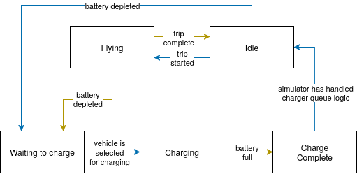
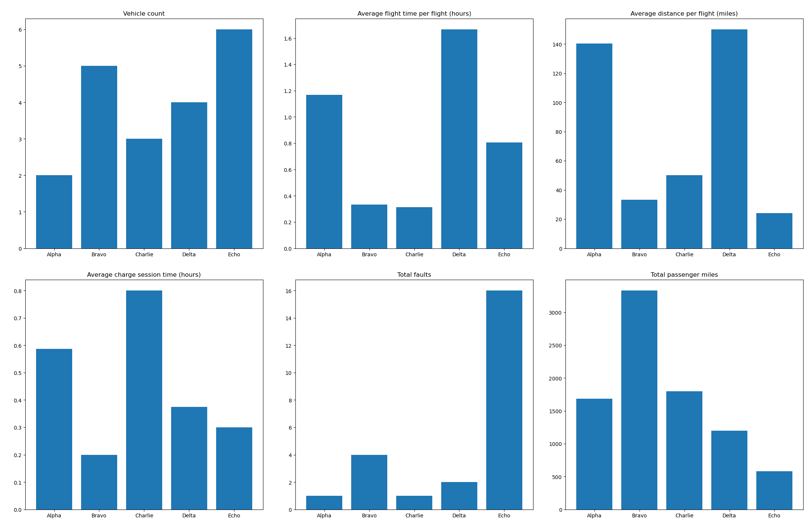
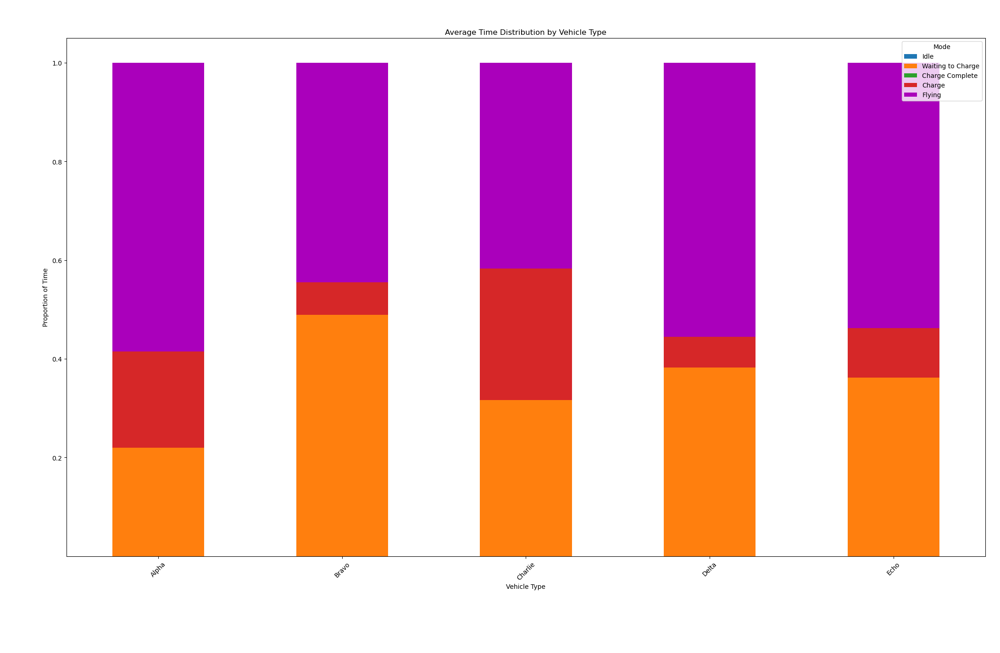

# eVTOL simulator

## Implementation

The `Aircraft` class is a base class containing operational characteristics, simulation variables, and the methods used to emulate the behavior of an aircraft during different operational modes. There are five derived classes for each of the given aircraft types. Here, each derived class only updates the operational characteristics, but in a more realistic simulator they would also override the `fly()`, `charge()`, etc. methods with the behaviors unique to the aircraft.

The `Simulator` class controls the fleet, manages the charging queue, and generates various types of reports.

Each timestep in the simulation runs the following state machine for each aircraft. The blue arrows in the state machine represent transitions initiated by the simulator, and Yellow arrows indicate transitions initiated by the aircraft itself.

Note: the state machine implementation is in the `Simulator` because the majority of the transitions were initiated by the `Simulator`, and it was easier during dev. It's more correct to put the state machine implementation in the `Aircraft` class so they can have their custom states, but I don't want to refactor now.



The chargers are implemented as a FIFO queue - the first in line/longest waiting for the charger has the highest priority to charge. This is implemented by counting the number of ticks since the most recent transition to the `WAITING_TO_CHARGE` state. When a charger becomes available, the simulator will charge the aircraft with the highest tick count.

## Reports

The simulator generates three types of reports.

1. **Mode distribution** - reports percentage of time that each aircraft is in each mode. Keeping track of mode stats makes calculating per-type stats easy.
2. **Step stats** - reports per-vehicle statistics for a single timestep in the simulation. Most useful for debugging.
3. **Per-type stats** - as requested in the problem description.

## Testing

Test strategies: this is not production code, so not as thorough with tests as I usually am :-)
- Primarily used the step stats report with a manageable timestep, duration, and number of vehicles, carefully observing that the vehicles were behaving as expected with each tick of the simulation.
- Good old print statements.

There are a few small samples in `tests/` demonstrating usage of `gtest` for more comprehensive unit testing.

## Running

- `make clean ; make ; ./build/joby`
- `make test` to run tests
- Change `srand()` seed in `main.cpp` for a new, unique sim

## Assumptions made
- **Faults are for every mode, not just flight.** Given that the probability is so vague (and seems quite high per hour) this is a justifiable assumption. See comment below about more descriptive fault behavior.
- **Faults are largely non-critical, so they don't affect operation in this simulation.** Probability is far too high for it to be a critical fault requiring immediate landing/taking out of the sim (10^-9 probability of fault per hour for catastrophic failures).
- **All trips use maximum passengers and maximum trip distance.** Makes the simulation simpler but reduces realism. A more sophisticated model would vary these parameters.

## How to make it better
- **More descriptive parameters** - each aircraft in reality would have unique battery characteristics (charge/discharge curves), takeoff/landing behavior, aerodynamic profiles, etc. A more accurate sim would address these - for example, having separate `battery_discharge()`, `battery_charge()` methods for each aircraft.
- **Vary trip parameters** - for a more realistic simulation.
- **Improved charging scheme** - each aircraft is spending a large percentage of time waiting to charge. To maximize profit, the charging scheme needs to change. Aircraft should get in and get out of the charger as fast as possible, only charging to what they need for a trip plus some reserves. (Or just get more chargers.)
- **More descriptive fault behavior** - the probability given is very vague. Should define different criticalities of faults, and have probabilities for each mode. Or even better, different fault probabilities for each subsystem, for each mode, for each criticiality.
- **Add a maintenance mode** - to allow aircraft to recover from all those faults (adds realism).

## Results

### Sample output

Here are the per-type statistics as requested in the problem description:



```
VehicleType,VehicleCount,FlightTimePerFlight(Hours),DistPerFlight,ChgSessionTime,TotalFaults,TotalPassengerMiles
Alpha,2,1.16933,140.32,0.587361,1,1682
Bravo,5,0.333347,33.3333,0.200028,4,3330
Charlie,3,0.312514,50,0.8,1,1797
Delta,4,1.66669,150,0.374708,2,1200
Echo,6,0.8069,24.2067,0.300028,16,579
```

Here is an additional plot showing the percentage of time that each aircraft type spent in each state.



```
VehicleNumber,VehicleType,Idle,Wait_Chg,Chg_Done,Chg,Fly
0,Charlie,3.7037e-05,0.316602,9.25926e-06,0.266667,0.416685
1,Alpha,1.85185e-05,0.186194,9.25926e-06,0.2,0.613778
2,Delta,9.25926e-06,0.252861,0,0.191565,0.555565
3,Alpha,9.25926e-06,0.252861,0,0.191574,0.555556
4,Bravo,3.7037e-05,0.488815,9.25926e-06,0.0666759,0.444463
5,Bravo,3.7037e-05,0.488815,9.25926e-06,0.0666759,0.444463
6,Echo,1.85185e-05,0.325241,9.25926e-06,0.100009,0.574722
7,Bravo,3.7037e-05,0.488815,9.25926e-06,0.0666759,0.444463
8,Charlie,3.7037e-05,0.316602,9.25926e-06,0.266667,0.416685
9,Delta,9.25926e-06,0.386185,0,0.0582407,0.555565
10,Echo,1.85185e-05,0.325241,9.25926e-06,0.100009,0.574722
11,Bravo,3.7037e-05,0.488815,9.25926e-06,0.0666759,0.444463
12,Echo,1.85185e-05,0.325241,9.25926e-06,0.100009,0.574722
13,Charlie,3.7037e-05,0.316602,9.25926e-06,0.266667,0.416685
14,Echo,1.85185e-05,0.35437,9.25926e-06,0.100009,0.545593
15,Delta,9.25926e-06,0.444426,0,0,0.555565
16,Echo,1.85185e-05,0.421037,9.25926e-06,0.100009,0.478926
17,Delta,9.25926e-06,0.444426,0,0,0.555565
18,Bravo,3.7037e-05,0.488815,9.25926e-06,0.0666759,0.444463
19,Echo,1.85185e-05,0.421046,9.25926e-06,0.100009,0.478917
```
